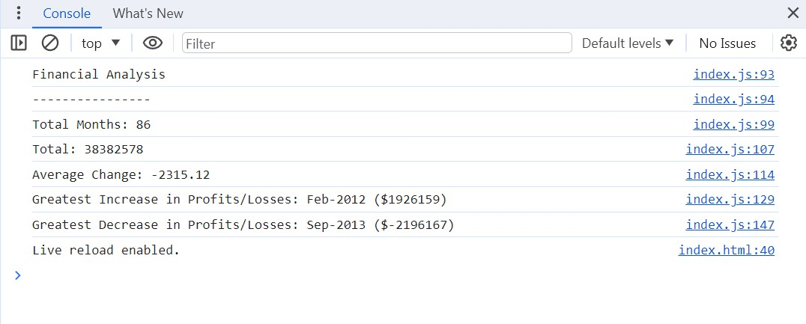

# Console-Finances

## Description

This simple application introduces fundamental programming concepts using the JavaScript language. Given a financial dataset, do financial calculations and interactions via the console.

## Folder Structure

- **index.html**: The main HTML file for this assignment.
- **index.js**: The JavaScript file for this assignment.
- **image:** includes 1 image
  - **Console-Finances-Screenshot.jpg:** Screenshot for web console of this assignment.
- **README.md:** This file.

## Links

[Visit my application](https://celia103.github.io/Console-Finances/)

[Visit the GitHub repository](https://github.com/celia103/Console-Finances)

- Application Screenshot:

## License

MIT License

